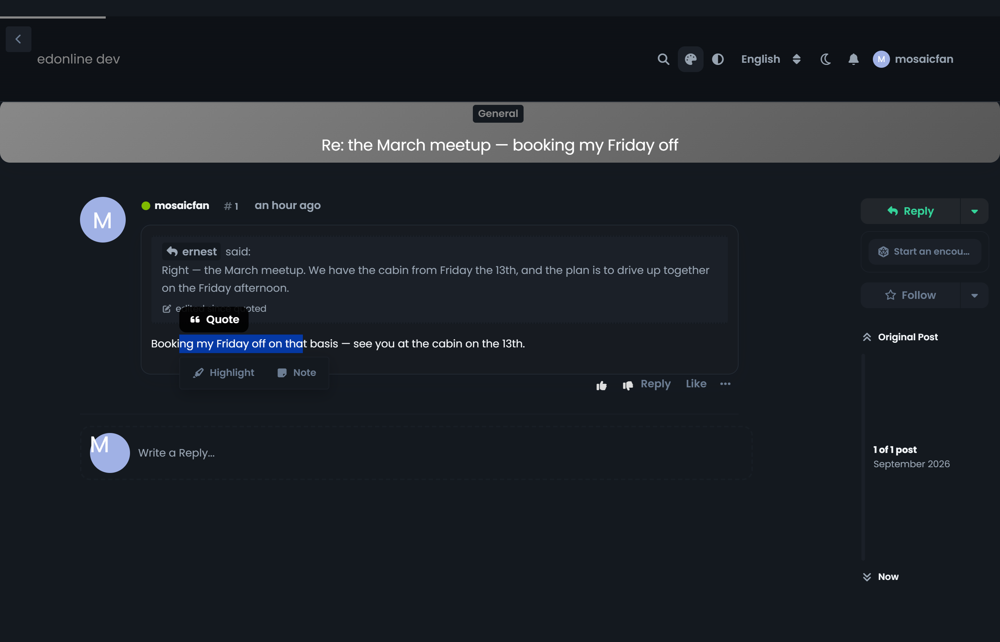
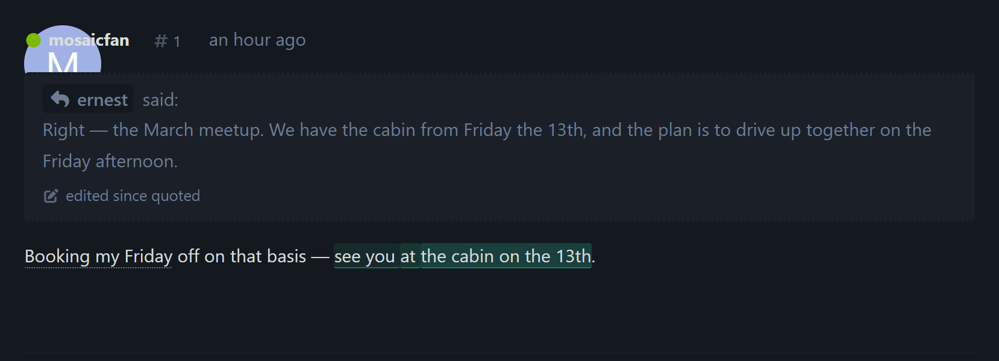
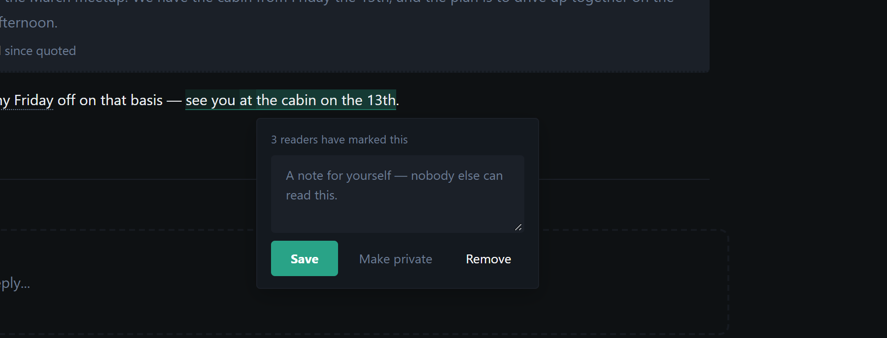

# Marginalia

Highlight a passage in a **Flarum 2** post. Keep it to yourself with a note, or
mark it publicly — and the sentences people keep marking start to glow.


## What it looks like

Select any passage in a post and two actions appear:



Public marks aggregate. One reader's mark is a faint tint; the stretch three
readers all marked is unmistakable — and the reader's own private mark is a
dotted rule rather than a tint, because it is not heat, it is a bookmark.



Click a mark to see how many people marked it, write the note that only you can
read, change your mind about it being public, or take it back:



## The privacy model, which is the point

- **A private mark is its author's and nobody else's** — not moderators', not
  admins'. A reading aid other people can inspect is a surveillance feature.
- **The note is always private, whether or not the mark is public.** Publishing
  a mark says *where somebody looked*. It never publishes what they wrote about
  it — which is also what keeps this feature out of the moderation queue that a
  second public text channel would land it in.
- Both are enforced on the server twice over: the model scope decides what can
  be queried at all, and the post relationship decides what is serialised.
  `note` is serialised for its author alone.

## How a mark survives an edit

A highlight is an **anchor**, not a copy: an offset into the post's plain text,
the passage itself, and forty characters of context either side. Nothing of the
post's words is duplicated.

When the post is drawn, the passage is found again — at its old offset first,
then by its context, then by the nearest identical run of text. A passage that
has been edited away is **not drawn**, because the alternative is putting
somebody's mark on words they never marked.

| Piece | What it does |
|---|---|
| `anchor.js` | plain-text offsets ↔ DOM ranges, and the three-step re-anchor |
| `paint.js` | resolves every mark, merges overlaps into heat, draws them |
| `Layer.js` | the selection toolbar and the mark popup |
| `HighlightResource` | create, update and delete; `note` visible to its author only |

Marks travel **with the post** as an API relationship rather than a separate
request, so they are painted on the first render instead of appearing a beat
later.

## Permissions

| Permission | Default |
|---|---|
| `marginalia.highlight` — mark a passage | Members |
| `marginalia.moderate` — remove someone else's **public** mark | Moderators |

Private marks are nobody's to remove but their author's, moderators included.

## Installation

```bash
composer require ernestdefoe/marginalia
```

## Licence

MIT
